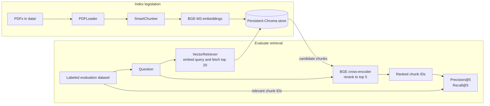

# UAE Legislation Retrieval

A local retrieval-augmented generation (RAG) foundation for searching UAE legislation PDFs. The current runnable workflow builds a searchable index from English and Arabic documents, retrieves and reranks passages for labeled questions, and reports retrieval quality with Precision@5 and Recall@5.

> **Current scope:** this repository is a retrieval and evaluation pipeline, not an interactive legal chatbot. It does not yet generate legal answers or provide legal advice.

## How It Works



The entry point, `src/main.py`, loads the evaluation cases from `data/evaluation/retrieval_dataset_candidates.json`, indexes PDFs found directly inside `data/`, and evaluates each question. It prints the retrieved chunk IDs, per-question metrics, and mean metrics for the dataset.

## Quick Start

Use Python 3.10 or newer. From the repository root, create an environment and install the dependencies:

```bash
python3 -m venv .venv
source .venv/bin/activate
python -m pip install --upgrade pip
python -m pip install -r requirements.txt python-dotenv
```

Run the retrieval evaluation from the repository root:

```bash
python -m src.main
```

On first use, Sentence Transformers downloads the embedding and reranking models. The embedding model is `BAAI/bge-m3`; the reranker is `BAAI/bge-reranker-v2-m3` and is configured to run on CPU. Chroma persists its local collection under `chroma_db/` by default.

## Add or Change Documents

Place text-based PDF files directly in `data/`. The loader scans that directory for `*.pdf`, extracts text page by page, and skips pages with no extractable text. Scanned image-only PDFs need OCR before they can be indexed.

The chunker groups text by article and numbered clause, then splits oversized clauses into smaller passages. The active entry point configures a 500-character chunk size. Each chunk stores source metadata, including its source filename, page, article, clause, and, when needed, part number.

## Evaluation Data

The active dataset is `data/evaluation/retrieval_dataset_candidates.json`. It is a JSON array with one object per question:

```json
[
  {
    "question": "When does the decree come into force?",
    "relevant": ["1-en.pdf:1:Article (3):1"]
  }
]
```

`relevant` contains the expected chunk IDs for that question. These IDs must match the `chunk_id` values generated during indexing. `precision_at_k` measures the fraction of the first five retrieved results that are labeled relevant; `recall_at_k` measures the fraction of all labeled relevant chunks found among those results.

The repository also contains `data/evaluation/retrieval_dataset.json`, an alternate evaluation set that `src/main.py` does not currently load. The evaluation dataset generator can write question-to-chunk examples to a JSON path, but its invocation in `main.py` is commented out.

## Pipeline Components

| Component | Responsibility |
| --- | --- |
| `src/rag/loader.py` | Extract page text and source locations from PDFs. |
| `src/rag/chunker.py` | Split legal pages into article-, clause-, and size-aware chunks. |
| `src/rag/embeddings.py` | Create normalized multilingual text embeddings. |
| `src/rag/vectore_store.py` | Persist and search embeddings with Chroma. |
| `src/rag/retriever.py` | Embed questions and retrieve candidate chunks. |
| `src/rag/reranker.py` | Rerank candidates with a BGE cross-encoder. |
| `src/rag/rag.py` | Define pipeline contracts and coordinate ingestion and retrieval. |
| `src/evaluation/` | Generate evaluation questions and calculate retrieval metrics. |
| `src/prompts/` | Store and load prompt templates. |

## Optional Question Generation

An OpenAI-compatible question generator and a prompt template are included, but the active evaluation entry point does not call the generator. The generator reads `AZURE_AD_TOKEN_PROVIDER` as its API key and `AZURE_FOUNDARY_ENDPOINT` as its base URL. These names reflect the current implementation; the endpoint variable is spelled `FOUNDARY` in the code. Although generation is optional, `main.py` imports the generator module, so `python-dotenv` is needed to run the current entry point. The `.env.example` file currently lists `PINECONE_API_KEY`, which is not used by the local Chroma retrieval workflow.

## Repository Layout

```text
data/
  *.pdf                         Source legislation PDFs
  evaluation/
    retrieval_dataset.json      Additional evaluation questions
    retrieval_dataset_candidates.json  Dataset used by the active runner
src/
  evaluation/                   Dataset generation and metrics
  prompts/                      Prompt template and loader
  rag/                           PDF, chunking, embedding, and retrieval code
  main.py                        Ingestion and retrieval-evaluation entry point
chroma_db/                       Persistent local Chroma database
requirements.txt                 Python dependencies
```

## Notes

- Run `python -m src.main` from the repository root so its relative data and database paths resolve as expected.
- Chroma persists its collection and the entry point does not clear or reconcile it before ingestion. After changing source documents or chunking behavior, rebuild the local index deliberately and keep evaluation IDs in sync.
- Retrieval metrics use exact chunk-ID matches; changes to chunking or source filenames may require updating the evaluation labels.
- This project is experimental. Verify all retrieved legal text against the authoritative legislation before relying on it.